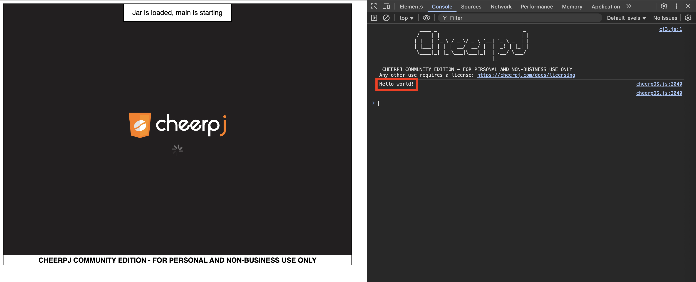

# Hello world with `jcherp`

[JCherp](https://cheerpj.com/) is in-browser JVM implementation.

So if you really want to launch your Hello World in browser - you can.

However, there are more steps to take to achieve that.

## Create a executable JAR

Compiling and creating executable JAR in retro way is good enough for this case.

So execute:
```shell
javac --release 8 Hello.java
jar cfe Hello.jar Hello Hello.class
```

The `--release 8` param is required because JCharp expects Java 1.8 classes by default.

You can verify JAR file by executing:
```shell
java -jar Hello.jar
# "Hello world!" should appear.
```

## Running the JAR in browser

To run http server, you need installed NodeJS installed with `npx` command.
Then run:
```shell
npx http-server -p 8080
```

After the http server is started open http://localhost:8080. 
The initialization takes few seconds, but finally we can notice our `Hello World!` in developers console.


